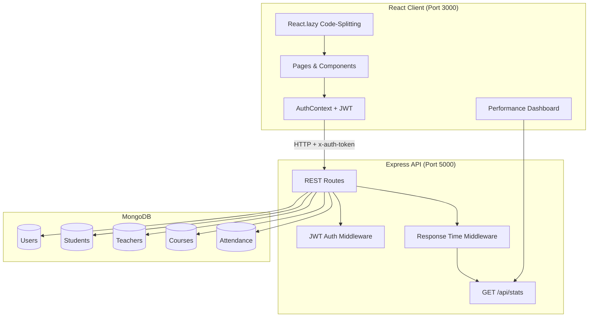

# Attendee

**A full-stack student attendance management platform with role-based access, real-time tracking, and built-in API performance observability.**

[](https://attendee-6ox7.onrender.com)
[](https://react.dev/)
[](https://expressjs.com/)
[](https://www.mongodb.com/)
[](https://jwt.io/)

> Replace screenshot placeholders below with your own captures before sharing on GitHub — visuals significantly improve recruiter engagement.

---

## Table of Contents

- [Overview](#overview)
- [Live Demo](#live-demo)
- [Key Features](#key-features)
- [Tech Stack](#tech-stack)
- [Architecture](#architecture)
- [Project Structure](#project-structure)
- [Getting Started](#getting-started)
- [Environment Variables](#environment-variables)
- [Demo Credentials](#demo-credentials)
- [API Reference](#api-reference)
- [Performance & Observability](#performance--observability)
- [Screenshots](#screenshots)
- [What I Learned](#what-i-learned)
- [Future Improvements](#future-improvements)
- [Author](#author)
- [License](#license)

---

## Overview

**Attendee** is a MERN-stack web application that digitizes classroom attendance for universities and training programs. Teachers can mark and edit attendance per course and date; students can view their attendance history and percentage in real time.

The project goes beyond a typical CRUD demo: it includes **JWT authentication with role-based routing**, **MongoDB relational schemas** (users, students, teachers, courses, attendance), **route-level React code-splitting**, and a **live API performance dashboard** that tracks average and P95 response times per endpoint — useful for demonstrating engineering rigor in interviews.

---

## Live Demo

| Resource | URL |
|----------|-----|
| **Frontend** | [attendee-dun.vercel.app](attendee-dun.vercel.app) |
<!-- | **Performance Dashboard** | [https://attendee-6ox7.onrender.com/performance](https://attendee-6ox7.onrender.com/performance) | -->
| **API Stats** | `GET https://attendee-6ox7.onrender.com/api/stats` |

> **Note:** The backend is hosted on Render's free tier. The first request after idle time may take 30–60 seconds to wake up.

---

## Key Features

### For Students
- Secure login with JWT session persistence
- Personal dashboard with profile and enrolled courses
- Per-course attendance history with date-wise records
- Real-time attendance percentage calculation
- Low-attendance visibility for self-monitoring

### For Teachers
- Teacher dashboard with assigned courses and class counts
- Mark attendance for all enrolled students on a given date
- Edit existing attendance records
- Validation against future dates and duplicate entries
- Course detail view with enrolled student roster

### Platform & Engineering
- Role-based protected routes (`student` / `teacher`)
- RESTful API with Express 5 and Mongoose ODM
- Password hashing with bcrypt
- Response-time middleware with per-endpoint avg & P95 metrics
- React.lazy() route-level code-splitting for smaller initial bundles
- Seed script with realistic demo data (10 students, 2 teachers, 5 courses)

---

## Tech Stack

| Layer | Technologies |
|-------|-------------|
| **Frontend** | React 19, React Router 7, Axios, Context API, CSS |
| **Backend** | Node.js, Express 5, JWT, bcryptjs |
| **Database** | MongoDB, Mongoose 9 |
| **Dev Tools** | Nodemon, Create React App, Tailwind CSS (dev) |
| **Deployment** | Render (API + static frontend) |

---

## Architecture



### Data Model

```
User (auth) ──┬── Student ── enrolledCourses ── Course
              └── Teacher ── teachingCourses ── Course
                                              └── Attendance (per date, per student)
```

---

## Project Structure

```
Attendee/
├── client/                          # React frontend
│   ├── public/
│   └── src/
│       ├── components/
│       │   ├── auth/                # Login
│       │   ├── Courses/             # Course details
│       │   ├── layout/              # Navbar, Home
│       │   ├── performance/         # API metrics dashboard
│       │   ├── routing/             # PrivateRoute (RBAC)
│       │   ├── student/             # Student dashboard & attendance view
│       │   └── teacher/             # Teacher dashboard & mark attendance
│       ├── context/
│       │   └── AuthContext.js       # Global auth state
│       └── App.js                   # Routes + lazy loading
│
├── server/                          # Express backend
│   ├── controllers/                 # Business logic
│   ├── middlewares/
│   │   ├── auth.js                  # JWT verification
│   │   └── responseTime.js          # API performance tracking
│   ├── models/                      # Mongoose schemas
│   ├── routes/                      # API route definitions
│   ├── seed.js                      # Database seeder
│   └── server.js                    # Entry point
│
├── PERFORMANCE_METRICS.md           # Interview demo guide
└── README.md
```

---

## Getting Started

### Prerequisites

- [Node.js](https://nodejs.org/) v18+
- [MongoDB](https://www.mongodb.com/) (local instance or [MongoDB Atlas](https://www.mongodb.com/atlas) cluster)
- npm or yarn

### 1. Clone the repository

```bash
git clone https://github.com/<your-username>/Attendee.git
cd Attendee
```

### 2. Set up the backend

```bash
cd server
npm install
```

Create a `.env` file in the `server/` directory (see [Environment Variables](#environment-variables)).

Start the API server:

```bash
npm start
```

The server runs at `http://localhost:5000`.

### 3. Seed the database (optional but recommended)

With the server stopped or in a separate terminal:

```bash
cd server
node seed.js
```

This populates the database with teachers, students, courses, and sample attendance records.

### 4. Set up the frontend

```bash
cd client
npm install
npm start
```

The app opens at `http://localhost:3000`.

### 5. Point the client to your local API

For local development, update the API base URL in `client/src/context/AuthContext.js`:

```js
const url = "http://localhost:5000";
```

Some dashboard components also reference the production URL directly. Search for `attendee-6ox7.onrender.com` in `client/src/` and replace with your local URL when developing offline.

---

## Environment Variables

Create `server/.env`:

```env
MONGO_URI=mongodb://localhost:27017/attendee
JWT_SECRET=your_super_secret_jwt_key_here
PORT=5000
```

| Variable | Description |
|----------|-------------|
| `MONGO_URI` | MongoDB connection string (local or Atlas) |
| `JWT_SECRET` | Secret key for signing JWT tokens |
| `PORT` | Server port (default: `5000`) |

> Never commit `.env` files. They are already listed in `server/.gitignore`.

---

## Demo Credentials

After running `node seed.js`, use these accounts:

| Role | Email | Password |
|------|-------|----------|
| **Teacher** | `sarah.johnson@example.com` | `password123` |
| **Teacher** | `michael.chen@example.com` | `password123` |
| **Student** | `student1@example.com` – `student10@example.com` | `password123` |

---

## API Reference

Base URL: `http://localhost:5000/api` (or production URL)

### Authentication

| Method | Endpoint | Auth | Description |
|--------|----------|------|-------------|
| `POST` | `/auth/login` | No | Login with email & password; returns JWT |
| `GET` | `/auth/user` | Yes | Get current user profile |

### Students

| Method | Endpoint | Auth | Description |
|--------|----------|------|-------------|
| `GET` | `/students` | No | List all students |
| `GET` | `/students/:id` | No | Get student with enrolled courses |

### Teachers

| Method | Endpoint | Auth | Description |
|--------|----------|------|-------------|
| `GET` | `/teachers` | No | List all teachers |
| `GET` | `/teachers/:id` | No | Get teacher with teaching courses |

### Courses

| Method | Endpoint | Auth | Description |
|--------|----------|------|-------------|
| `GET` | `/courses` | No | List all courses |
| `GET` | `/courses/:id` | No | Get course with teacher & students |

### Attendance

| Method | Endpoint | Auth | Description |
|--------|----------|------|-------------|
| `POST` | `/attendance` | No | Mark attendance for a course & date |
| `GET` | `/attendance/course/:courseId` | No | Get all attendance records for a course |
| `PUT` | `/attendance/course/:courseId` | No | Edit attendance for a specific date |

### Performance

| Method | Endpoint | Auth | Description |
|--------|----------|------|-------------|
| `GET` | `/stats` | No | Per-endpoint request count, avg & P95 response times |

**Auth header:** `x-auth-token: <JWT>`

---

## Performance & Observability

This project includes measurable performance features you can demo in interviews or cite on a resume.

### API Response Times

- Middleware in `server/middlewares/responseTime.js` tracks every `/api/*` request
- Metrics exposed at `GET /api/stats` and visualized at `/performance`
- Per-endpoint: **request count**, **average (ms)**, **P95 (ms)**


### Frontend Bundle Optimization

- Route-level code-splitting via `React.lazy()` and `Suspense` in `App.js`
- Each major screen (dashboards, attendance, performance) loads as a separate chunk

```bash
cd client && npm run build
```


## What I Learned

- Designing **role-based access control** with JWT and protected React routes
- Modeling **relational data in MongoDB** with population and cross-references
- Building **RESTful APIs** with validation, error handling, and middleware composition
- Measuring and presenting **real performance metrics** (not just "it's fast")
- **Code-splitting** strategies to reduce initial JavaScript payload

---

## Future Improvements

- [ ] Centralize API base URL via environment variable (`REACT_APP_API_URL`)
- [ ] Add registration flow and admin role
- [ ] Email/SMS alerts for low attendance thresholds
- [ ] Export attendance reports (CSV / PDF)
- [ ] Unit and integration tests (Jest, Supertest, React Testing Library)
- [ ] Docker Compose for one-command local setup
- [ ] CI/CD pipeline with GitHub Actions

---

